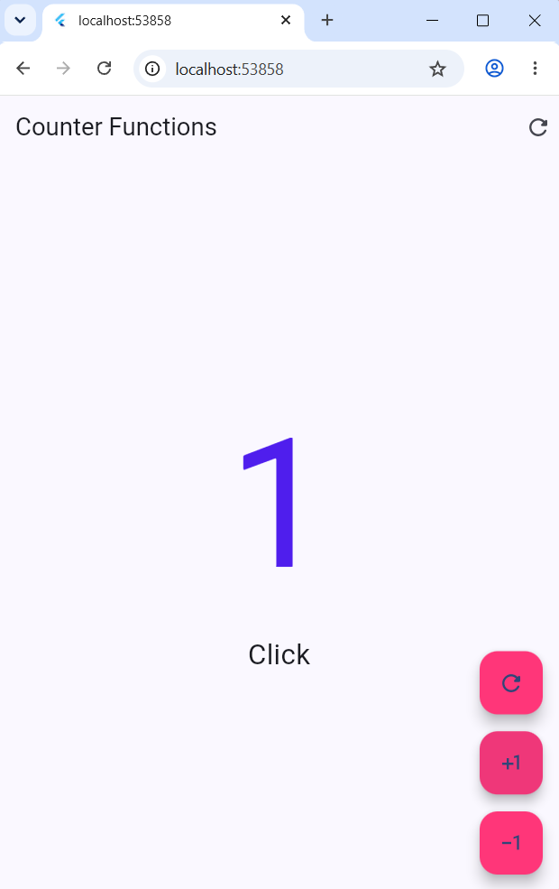
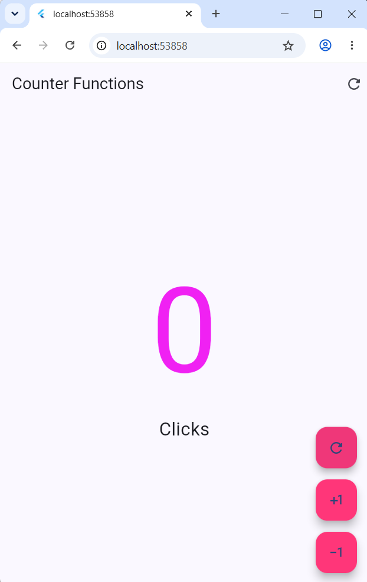
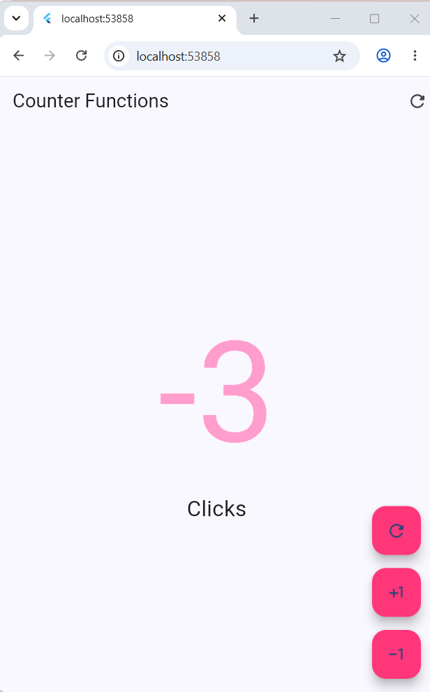

# 🌸 Práctica 02 — Mi Primera Aplicación Móvil con Flutter

## 💗 Descripción

En esta práctica se desarrolló una aplicación móvil interactiva utilizando **Flutter** y el lenguaje de programación **Dart**. El proyecto consiste en un contador que permite incrementar, disminuir y reiniciar su valor mediante botones.

La aplicación incorpora elementos visuales dinámicos que cambian de acuerdo con el estado del contador, utilizando diferentes colores para representar valores positivos, negativos y neutros.

El objetivo de esta actividad es conocer los fundamentos del desarrollo de aplicaciones móviles con Flutter, poniendo en práctica el uso de widgets, el manejo de estados y la interacción del usuario con la interfaz.

---

## 🛠️ Tecnologías utilizadas

| Tecnología                                 | Descripción                                                            |
| ------------------------------------------ | ---------------------------------------------------------------------- |
| 💙 **Flutter**                             | Framework utilizado para crear la aplicación móvil.                    |
| 🎯 **Dart**                                | Lenguaje de programación empleado para desarrollar la lógica.          |
| 🎨 **Material Design**                     | Componentes y estilos utilizados para diseñar la interfaz.             |
| 💻 **Visual Studio Code / Android Studio** | Herramientas utilizadas para desarrollar y ejecutar el proyecto.       |
| 🌐 **Git y GitHub**                        | Herramientas para el control de versiones y almacenamiento del código. |

---

## 📋 Actividades realizadas

Durante el desarrollo de esta práctica se llevaron a cabo las siguientes actividades:

* Creación de una aplicación móvil con Flutter.
* Exploración de la estructura básica de un proyecto Flutter.
* Desarrollo de la pantalla principal utilizando `StatefulWidget`.
* Declaración de una variable entera para almacenar el valor del contador.
* Implementación de las funciones para aumentar y disminuir el contador.
* Incorporación de una opción para regresar el contador a cero.
* Uso de `setState()` para reflejar los cambios en la interfaz.
* Diseño de botones flotantes con `FloatingActionButton`.
* Creación de un componente reutilizable llamado `CustomButton`.
* Integración de iconos de Material Icons para representar las acciones.
* Aplicación de colores dinámicos según el valor del contador.
* Implementación de texto dinámico para mostrar “Click” o “Clicks”.
* Ajuste de la condición gramatical para los valores `1` y `-1`.
* Organización de los elementos con `Column`, `Center`, `Scaffold` y `AppBar`.
* Uso de `SizedBox` para mejorar la distribución y el espaciado de los botones.

---

## ⚙️ Funcionamiento de la aplicación

La aplicación permite realizar tres acciones principales para interactuar con el contador.

### 💕 Incrementar

Al presionar el botón con el icono `plus_one`, el valor del contador aumenta una unidad.

```dart
clickCounter++;
```

### 🌷 Disminuir

El botón con el icono `exposure_minus_1_outlined` permite restar una unidad al contador.

```dart
clickCounter--;
```

### 🔄 Reiniciar

Al seleccionar el botón con el icono `refresh_rounded`, el contador vuelve a su valor inicial.

```dart
clickCounter = 0;
```

Cada operación se ejecuta dentro de `setState()`, lo que permite actualizar automáticamente el valor mostrado en pantalla.

---

## 🎨 Colores dinámicos del contador

Para mejorar la experiencia visual, el contador cambia de color dependiendo del número que se encuentre mostrando.

| Estado      | Condición     | Color |
| ----------- | ------------- | ----- |
| 🔴 Negativo | Menor que `0` | Rojo  |
| 🔵 Neutro   | Igual a `0`   | Azul  |
| 🟢 Positivo | Mayor que `0` | Verde |

La lógica utilizada para determinar el color es la siguiente:

```dart
color: clickCounter < 0
    ? Colors.red
    : clickCounter == 0
        ? Colors.blue
        : Colors.green,
```

De esta manera, el usuario puede identificar fácilmente el estado actual del contador mediante un cambio visual.

---

## ✨ Texto dinámico

La aplicación adapta automáticamente el texto que aparece debajo del número del contador.

Cuando el valor es `1` o `-1`, se utiliza la palabra en singular. Para los demás valores, se muestra en plural.

**Ejemplos:**

| Valor | Texto mostrado |
| ----: | -------------- |
|   `1` | 1 Click        |
|  `-1` | -1 Click       |
|   `0` | 0 Clicks       |
|   `2` | 2 Clicks       |
|  `-2` | -2 Clicks      |

La condición utilizada es:

```dart
'Click${clickCounter == 1 || clickCounter == -1 ? '' : 's'}'
```

Esto permite que el texto se actualice de acuerdo con el valor actual sin necesidad de modificarlo manualmente.

---

## 📱 Interfaz de usuario

La pantalla principal está diseñada para que las acciones del contador sean fáciles de identificar y utilizar.

Sus elementos principales son:

* **AppBar:** muestra el título de la aplicación y el botón de reinicio.
* **Contador principal:** presenta el valor actual con un tamaño de fuente destacado.
* **Texto descriptivo:** indica si se trata de uno o varios clicks.
* **Botón de incremento:** permite aumentar el valor.
* **Botón de decremento:** permite disminuir el valor.
* **Botón de reinicio:** devuelve el contador a cero.

Los botones se organizan verticalmente mediante un `Column`, manteniendo una distribución sencilla y ordenada.

---

## 🧩 Componente personalizado

Para reutilizar la estructura de los botones y evitar repetir código, se creó un widget personalizado llamado `CustomButton`.

```dart
class CustomButton extends StatelessWidget {
  final IconData icon;
  final VoidCallback? onPressed;

  const CustomButton({
    super.key,
    required this.icon,
    this.onPressed
  });
}
```

Este componente recibe los siguientes parámetros:

* `icon`: icono que se mostrará en el botón.
* `onPressed`: función que se ejecutará cuando el usuario presione el botón.

Su implementación facilita la reutilización de componentes y contribuye a mantener el código más organizado.

---

## 🖼️ Evidencias de funcionamiento

A continuación, se muestran las evidencias de los diferentes estados de la aplicación.

### 🟢 Contador positivo

Al incrementar el contador, el valor se vuelve mayor que cero y se representa en color verde.



---

### 🔵 Contador neutro

Cuando el contador regresa a cero, el número se muestra en color azul.



---

### 🔴 Contador negativo

Al disminuir el contador por debajo de cero, el valor cambia a color rojo.



---

## 📚 Conceptos aprendidos

Con la realización de esta práctica se reforzaron conocimientos relacionados con:

* Desarrollo de aplicaciones móviles con Flutter.
* Fundamentos del lenguaje Dart.
* Uso de `StatefulWidget` y `StatelessWidget`.
* Administración del estado mediante `setState()`.
* Declaración y modificación de variables.
* Operadores de incremento y decremento.
* Uso de condiciones y operadores ternarios.
* Manejo de eventos con `onPressed`.
* Creación de widgets reutilizables.
* Implementación de botones flotantes.
* Organización de interfaces mediante widgets.
* Uso de iconos de Material Design.
* Actualización dinámica de la interfaz.
* Diseño y distribución de elementos en aplicaciones móviles.

---

## 🌸 Conclusión

El desarrollo de esta práctica permitió crear una aplicación móvil funcional y comprender algunos de los principios fundamentales de Flutter y Dart.

A través de un contador interactivo, se puso en práctica el manejo de estados, la respuesta a eventos del usuario y la actualización automática de los elementos visuales.

Asimismo, se reforzó la importancia de organizar el código mediante componentes reutilizables y de mejorar la experiencia del usuario con elementos visuales dinámicos.

Esta actividad representa una introducción al desarrollo móvil y proporciona una base para la creación de aplicaciones más completas e interactivas.

---

## 🔗 Enlace directo

🏗️ **Arquitectura del proyecto:** 
---

<p align="center">
  🌷✨ <strong>Práctica 02 — Desarrollo Móvil Integral</strong> ✨🌷
</p>
