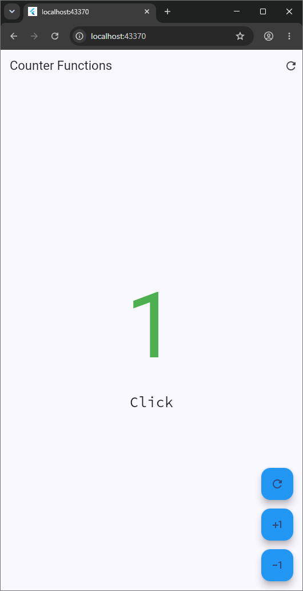
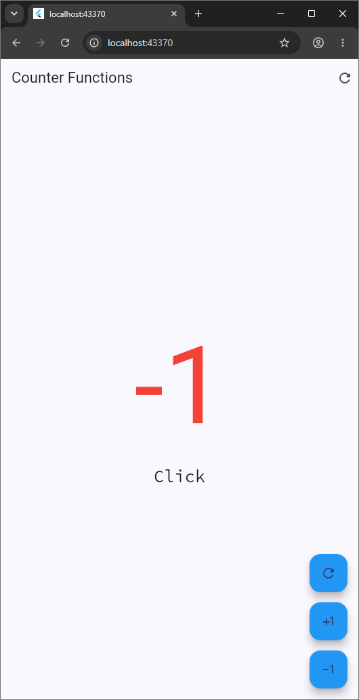

# 🌸 Práctica 02 — Primera Aplicación Móvil con Flutter 📱💗

<p align="center">
  
</p>

<p align="center">
  💗✨ <strong>Desarrollo Móvil Integral</strong> ✨💗
</p>

<p align="center">
  <strong>Primer Aplicación Móvil con Flutter</strong>
</p>

<p align="center">
  🌸 Contador interactivo desarrollado con Flutter y Dart 🌸
</p>---

## 🎀 Descripción

En esta práctica se desarrolló una aplicación móvil sencilla utilizando **Flutter** y el lenguaje de programación **Dart**.

La aplicación consiste en un **contador interactivo** que permite al usuario aumentar, disminuir y restablecer su valor mediante diferentes botones.

Además de implementar la funcionalidad básica del contador, se agregaron diferentes comportamientos visuales dependiendo del valor actual, permitiendo representar de manera clara los estados:

 **💙Positivo**
 **🌷Neutro**
❤️ **Negativo**

El propósito de esta práctica es introducir los conceptos fundamentales del desarrollo de interfaces móviles con Flutter, principalmente el uso de **widgets, manejo de estados, eventos de usuario y actualización dinámica de la interfaz**.

---

## 🌷 Tecnologías utilizadas

| Tecnología                                 | Descripción                                                                         |
| ------------------------------------------ | ----------------------------------------------------------------------------------- |
| 💙 **Flutter**                             | Framework utilizado para desarrollar la aplicación móvil.                           |
| 🎯 **Dart**                                | Lenguaje de programación utilizado por Flutter.                                     |
| 🎨 **Material Design**                     | Componentes y estilos visuales utilizados en la interfaz.                           |
| 💻 **Android Studio / Visual Studio Code** | Entornos utilizados para desarrollar y ejecutar el proyecto.                        |
| 🌐 **Git / GitHub**                        | Herramientas utilizadas para el control de versiones y almacenamiento del proyecto. |

---

## 🎀 Actividades realizadas

Durante el desarrollo de la práctica se realizaron las siguientes actividades:

* 🌸 Creación de un proyecto móvil utilizando Flutter.
* 🌸 Identificación y comprensión de la estructura básica de un proyecto Flutter.
* 🌸 Implementación de una pantalla principal mediante un `StatefulWidget`.
* 🌸 Creación de una variable entera para almacenar el valor actual del contador.
* 🌸 Implementación del incremento del contador mediante el operador `++`.
* 🌸 Implementación del decremento del contador mediante el operador `--`.
* 🌸 Implementación de un botón para restablecer el contador a cero.
* 🌸 Utilización de `setState()` para actualizar dinámicamente la interfaz.
* 🌸 Implementación de botones flotantes mediante `FloatingActionButton`.
* 🌸 Creación de un widget personalizado llamado `CustomButton`.
* 🌸 Uso de iconos proporcionados por Material Icons.
* 🌸 Implementación de estilos condicionales dependiendo del valor del contador.
* 🌸 Aplicación del color azul cuando el contador es igual a `0`.
* 🌸 Aplicación del color verde cuando el contador tiene un valor positivo.
* 🌸 Aplicación del color rojo cuando el contador tiene un valor negativo.
* 🌸 Implementación de texto dinámico para mostrar correctamente **“Click”** o **“Clicks”**.
* 🌸 Ajuste de la regla gramatical para considerar tanto `1` como `-1` como valores singulares.
* 🌸 Organización de los elementos mediante widgets como `Column`, `Center`, `Scaffold` y `AppBar`.
* 🌸 Incorporación de espaciado entre los botones mediante `SizedBox`.

---

## 💕 Funcionamiento

La aplicación cuenta con tres acciones principales:

### ➕ Incrementar

El botón con el icono `plus_one` aumenta el valor del contador en uno.

```dart
clickCounter++;
```
### ➖ Disminuir

El botón con el icono `exposure_minus_1_outlined` disminuye el valor del contador en uno.

```dart
clickCounter--;
```

### 🔄 Restablecer

El botón con el icono `refresh_rounded` establece nuevamente el contador en cero.

```dart
clickCounter = 0;
```

Todas estas operaciones se realizan dentro de `setState()`, permitiendo que Flutter reconstruya la interfaz y muestre inmediatamente el nuevo valor.

---

## 🌈 Cambio de color

El color del contador cambia dependiendo de su valor actual:

|  Valor |    Estado   | Color |
| :----: | :---------: | :---: |
|  `< 0` | ❤️ Negativo |  Rojo |
| `== 0` |  💗 Neutro  |  Azul |
|  `> 0` | 🔵 Positivo | Verde |

La condición utilizada para determinar el color es:

```dart
color: clickCounter < 0
    ? Colors.red
    : clickCounter == 0
        ? Colors.blue
        : Colors.green,
```

De esta manera, el usuario puede identificar visualmente el estado actual del contador.

---

## 💗 Texto dinámico

La aplicación también modifica automáticamente el texto mostrado debajo del contador.

Cuando el valor es `1` o `-1`, se utiliza la forma singular:

```text
1 Click
-1 Click
```

Para cualquier otro valor se utiliza la forma plural:

```text
0 Clicks
2 Clicks
-2 Clicks
5 Clicks
```

La condición implementada es:

```dart
'Click${clickCounter == 1 || clickCounter == -1 ? '' : 's'}'
```

Esto permite que la aplicación adapte automáticamente el texto al valor mostrado.

---

## 📱 Interfaz de usuario

La interfaz está compuesta por los siguientes elementos principales:

* 🎀 **AppBar:** contiene el título de la aplicación y un botón de reinicio.
* 🔢 **Contador:** muestra el valor actual utilizando un tamaño de fuente grande.
* 💬 **Texto descriptivo:** muestra “Click” o “Clicks” dependiendo del valor.
* 🔄 **Botón de reinicio:** establece el contador en `0`.
* ➕ **Botón de incremento:** aumenta el contador.
* ➖ **Botón de decremento:** disminuye el contador.

Los botones principales se encuentran agrupados verticalmente en la parte inferior de la pantalla mediante un `Column`.

---

## 🌸 Widget personalizado

Para evitar repetir código en cada botón se creó el widget reutilizable `CustomButton`.

```dart
class CustomButton extends StatelessWidget {
  final IconData icon;
  final VoidCallback? onPressed;

  const CustomButton({
    super.key,
    required this.icon,
    this.onPressed
  });
}
```

Este widget recibe:

* 🎨 `icon` — Icono que se mostrará.
* ⚙️ `onPressed` — Función que se ejecutará al presionar el botón.

Esto permite utilizar el mismo componente para las diferentes acciones del contador y mantener el código más organizado y reutilizable.

---

# 🧪 Evidencia de pruebas

La aplicación funciona correctamente como un contador interactivo y permite comprobar diferentes estados.

### 💙 Contador positivo

Al presionar el botón de incremento, el contador establece un número mayor a `0`, por lo que el número se muestra en **Azul**.

<p align="center">
  
</p>

---

###  💗Contador neutro

Al presionar el botón de decremento hasta que el contador llegue a `0`, el número se muestra en **rosa**.

<p align="center">
  
</p>

---

### ❤️ Contador negativo

Al presionar el botón de decremento después de llegar a cero, el contador cambia a `-1` o un valor menor, por lo que el número se muestra en **rosa fuerte**.

<p align="center">
  
</p>

---

## 🎨 Fuente personalizada

La fuente personalizada utilizada en la aplicación es:

**SourceCodePro-VariableFont_wght**

---

# 📚 Conceptos aprendidos

Con esta práctica se reforzaron los siguientes conceptos:

* 📱 Creación de proyectos Flutter.
* 🎯 Sintaxis básica de Dart.
* 🧩 Widgets con y sin estado.
* 🔄 `StatefulWidget`.
* 🧱 `StatelessWidget`.
* ⚡ `setState()`.
* 📦 Variables y tipos de datos.
* ➕ Operadores de incremento y decremento.
* 🔀 Condicionales.
* ❓ Operador ternario.
* 🖱️ Eventos mediante `onPressed`.
* ♻️ Widgets reutilizables.
* 🔘 `FloatingActionButton`.
* 📐 `Column`.
* 🎯 `Center`.
* 🏗️ `Scaffold`.
* 📌 `AppBar`.
* 🎨 Uso de iconos de Material Design.
* 📱 Diseño básico de interfaces móviles.
* 🔄 Actualización dinámica de elementos de una interfaz.

---

# 🌷 Conclusión

La práctica permitió desarrollar una primera aplicación móvil funcional utilizando **Flutter**.

Mediante un contador sencillo fue posible comprender cómo se administra el **estado de una aplicación** y cómo las acciones realizadas por el usuario pueden actualizar dinámicamente la interfaz.

También se practicó la creación de **componentes reutilizables** y el uso de condiciones para modificar elementos visuales y textos dependiendo del estado actual del contador.

Aunque la aplicación cuenta con una funcionalidad sencilla, representa una base importante para comprender conceptos que posteriormente pueden utilizarse en aplicaciones Flutter de mayor complejidad.

---

## 🔗 Enlace directo

<p align="center">
  🌸 <strong>Arquitectura del proyecto</strong> 🌸
</p>

<p align="center">
  <a href="https://jenniferbautistabarrios.github.io/Practicas_DMI_230317/Practica02/arquitectura/index.html">
    💗 Ver diagrama de arquitectura 💗
  </a>
</p>

---

<p align="center">
  💗✨ <strong>Práctica 02 — Desarrollo Móvil Integral</strong> ✨💗
</p>

<p align="center">
  🌸 Flutter + Dart + Creatividad 🌸
</p>
