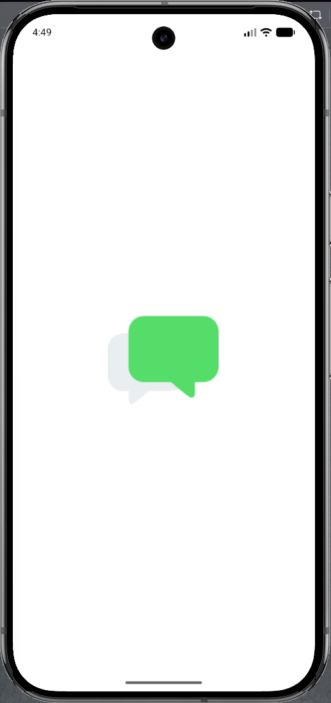

# Yes No App

Aplicación de chat desarrollada con Flutter. Permite enviar mensajes y recibir una respuesta aleatoria de **Sí** o **No** usando la API de [yesno.wtf](https://yesno.wtf/). También puede responder **Tal vez** localmente y mostrar un GIF.

## Funcionalidades

- Interfaz de chat con burbujas para los mensajes y sus respuestas.
- Hora de envio en cada burbuja del chat.
- Uso de la API yesno.wtf para obtener respuestas.
- Respuestas con probabilidades de 40% para "Sí", 40% para "No" y 20% para "Tal vez".
- Visualización de GIFs en las respuestas.
- Icono de la aplicación personalizado.

## Evidencias

**Icono personalizado de la aplicación**



**Respuestas en el chat**


## Diagrama de arquitectura

**Arquitectura del proyecto:** [Diagrama de la arquitectura del proyecto](https://diegomiguel04.github.io/Practicas_DMI_230260/Practica03/arquitectura/)

## Ejecución

Desde la carpeta `yes_no_app`, instala las dependencias y ejecuta la aplicación:

```bash
flutter pub get
flutter run
```