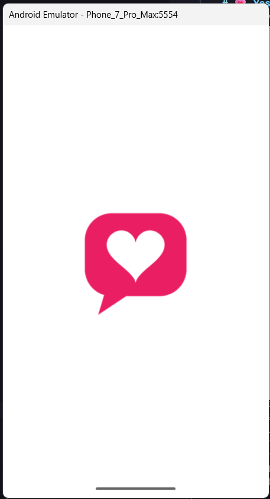
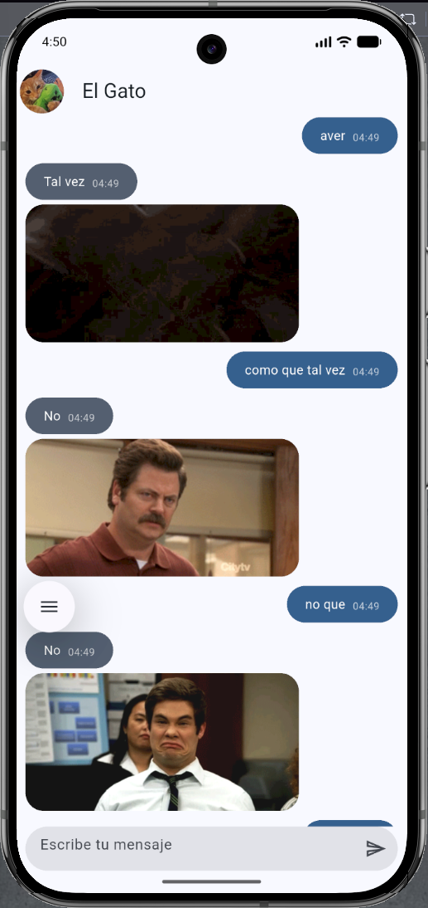
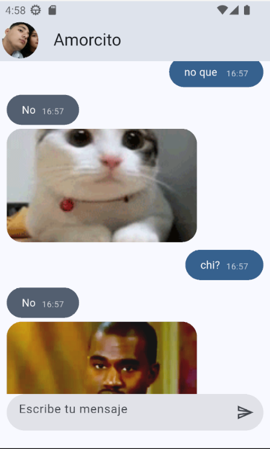
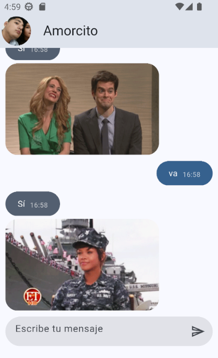

# 💗 Yes No App

<p align="center">
  🌸✨ <strong>Yes No App — Práctica 03</strong> ✨🌸
</p>

<p align="center">
  Aplicación de chat desarrollada con <strong>Flutter</strong> y <strong>Dart</strong>.
</p>

---

## 🌷 Descripción

**Yes No App** es una aplicación móvil desarrollada con Flutter que simula una conversación mediante un chat.

La aplicación permite enviar preguntas o mensajes y recibir respuestas de forma aleatoria. Para obtener las respuestas se utiliza la API de **yesno.wtf**, además de contar con una respuesta local de **"Tal vez"**.

Las respuestas pueden incluir un **GIF**, haciendo que la interacción sea más dinámica y visual.

---

## ✨ Funcionalidades

* 💬 Interfaz de chat con burbujas para los mensajes.
* 🕐 Muestra la hora de envío en cada mensaje.
* 🌐 Consumo de la API **yesno.wtf**.
* 💗 Respuestas aleatorias:

  * ✅ **Sí:** 40%
  * ❌ **No:** 40%
  * 🤔 **Tal vez:** 20%
* 🎞️ Visualización de GIFs en las respuestas.
* 📱 Icono personalizado para la aplicación.
* 🌸 Interfaz sencilla y fácil de utilizar.

---

## 🛠️ Tecnologías utilizadas

| Tecnología           | Uso                                     |
| -------------------- | --------------------------------------- |
| 🐦 **Flutter**       | Desarrollo de la aplicación móvil       |
| 💙 **Dart**          | Lenguaje de programación                |
| 🌐 **API yesno.wtf** | Obtención de respuestas                 |
| 🎞️ **GIFs**         | Representación visual de las respuestas |

---

## 📱 Evidencias

### 🌸 Icono personalizado de la aplicación

<p align="center">
  
</p>

### 💬 Respuestas en el chat

<p align="center">
  
</p>

<p align="center">
  
</p>

<p align="center">
  
</p>

---

## 🏗️ Diagrama de arquitectura

El proyecto cuenta con un diagrama donde se representa la arquitectura utilizada para organizar la aplicación.

🌐 **[Ver diagrama de arquitectura del proyecto](https://jenniferbautistabarrios.github.io/Practicas_DMI_230317/Practica03/arquitectura/index.html)**

---

## 🚀 Ejecución del proyecto

Para ejecutar la aplicación, primero debes ingresar a la carpeta del proyecto:

```bash
cd yes_no_app
```

Después instala las dependencias:

```bash
flutter pub get
```

Finalmente, ejecuta la aplicación:

```bash
flutter run
```

---

## 📂 Estructura del proyecto

La aplicación se encuentra organizada en diferentes carpetas para facilitar el mantenimiento y la separación de responsabilidades.

```text
yes_no_app/
│
├── android/
├── ios/
├── lib/
│   ├── config/
│   ├── domain/
│   ├── infrastructure/
│   ├── presentation/
│   └── ...
│
├── images/
│   ├── cap2.png
│   ├── cap3.png
│   └── cap4.png
│
├── pubspec.yaml
└── README.md
```

---

## 🌸 Conclusión

El desarrollo de **Yes No App** permitió poner en práctica el uso de **Flutter y Dart**, además del consumo de una API externa para obtener información y mostrarla dentro de una interfaz de chat.

También se trabajó con la organización del proyecto mediante diferentes carpetas y componentes, buscando mantener una estructura clara y fácil de comprender.

<p align="center">
  💗✨ <strong>Desarrollado con Flutter</strong> ✨💗
</p>
